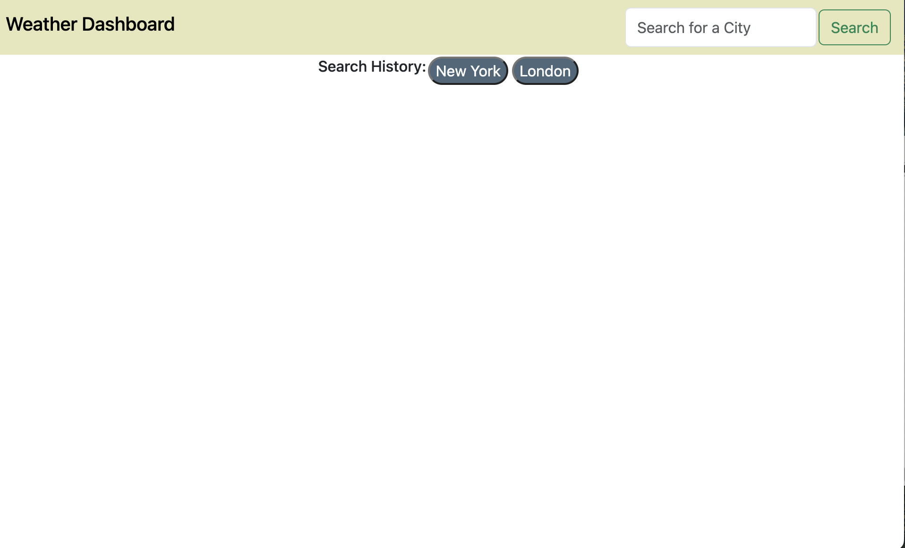
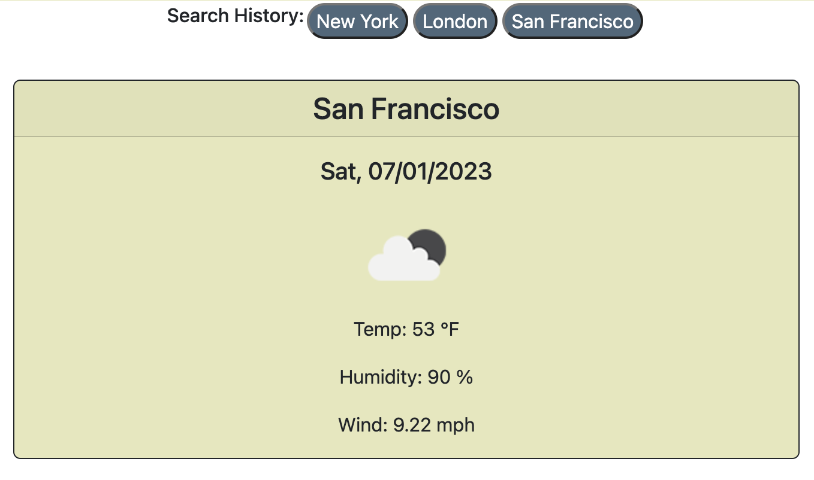
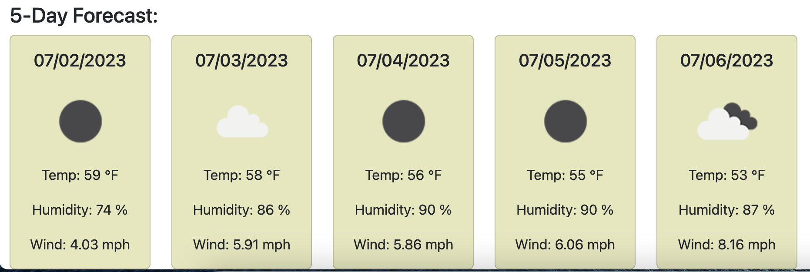

# weather-app
[](code_of_conduct.md)

## The Repository

This repository was made from scratch to create a weather dashboard application with JavaScript and the APIs provided by OpenWeather®.

---

## Installation

The code may be accessed on [GitHub](https://github.com/choelzli/weather-app) or visiting the site URL (https://choelzli.github.io/weather-app/).

Clone the repo:
```
git clone https://github.com/choelzli/weather-app.git
```
---

## Usage

Upon accessing the webpage, it displays a header that contains a title, an input field to enter a city, and a search button.  Previously searched cities are shown immediately below the header as buttons.



After clicking the search button, if the city is listed in the OpenWeatherAPI, the current weather conditions and 5-day forecast are rendered to the page. If the user clicks on a city in the Search History, the current weather and forecast for that city will render to the page instead.

 

---

## License

Licensed under the MIT license.

---

## Credits

Base code strategies provided by Columbia Coding Bootcamp. Other sources include:
* [The Contributor Covenant](https://www.contributor-covenant.org/)
* [OpenWeatherMap Docs: 5 Day Weather Forecast API](https://openweathermap.org/forecast5)
* [OpenWeatherMap Docs: Current Weather Data API](https://openweathermap.org/current)
* [OpenWeatherMap Docs: Geocoding API](https://openweathermap.org/api/geocoding-api)
* [README Template](https://github.com/othneildrew/Best-README-Template)
* [Stack Overflow: Display OpenWeatherMap Weather Icon](https://stackoverflow.com/questions/44177417/how-to-display-openweathermap-weather-icon)
* [VS Code README](https://github.com/microsoft/vscode/tree/main)
* [W3 Schools: CSS Rounded Corners](https://www.w3schools.com/css/css3_borders.asp)